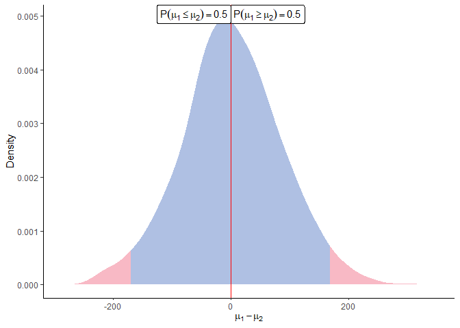

<!-- README.md is generated from README.Rmd. Please edit that file -->

# ProteoBayes <a href="https://mariechion.github.io/ProteoBayes/"></a>

<!-- badges: start -->

[](https://CRAN.R-project.org/package=ProteoBayes)
<!-- badges: end -->

Bayesian toolbox for quantitative proteomics. In particular, this
package provides functions to generate synthetic datasets, execute
Bayesian differential analysis methods, and display results.

## Installation

You can install the released version of ProteoBayes from CRAN with:

``` r
install.packages("ProteoBayes")
```

You can install the development version of ProteoBayes like so:

``` r
# install.packages("devtools")
devtools::install_github("mariechion/ProteoBayes")
```

If you want to use ProteoBayes without coding a single line, feel free
use our dedicated web app:
<https://arthurleroy.shinyapps.io/ProteoBayes/>.

For those who are keen to learn more about the R code behind, just
scroll down below!

## ProteoBayes in a nutshell

Generate a synthetic proteomics dataset with the correct format:

``` r
library(ProteoBayes)
set.seed(42)

## Generate a dataset without imputations
data = simu_db()

## Generate a dataset with multiple imputations
data_imp = simu_db(multi_imp = TRUE)

data
#> # A tibble: 50 x 4
#>    Peptide   Group Sample Output
#>    <chr>     <int>  <int>  <dbl>
#>  1 Peptide_1     1      1   48.8
#>  2 Peptide_1     1      2   46.5
#>  3 Peptide_1     1      3   49.8
#>  4 Peptide_1     1      4   49.9
#>  5 Peptide_1     1      5   47.4
#>  6 Peptide_1     2      1   54.9
#>  7 Peptide_1     2      2   49.4
#>  8 Peptide_1     2      3   52.0
#>  9 Peptide_1     2      4   49.6
#> 10 Peptide_1     2      5   55.0
#> # i 40 more rows
data_imp
#> # A tibble: 250 x 5
#>    Peptide   Group Sample Output  Draw
#>    <chr>     <int>  <int>  <dbl> <int>
#>  1 Peptide_1     1      1   51.8     1
#>  2 Peptide_1     1      1   51.3     2
#>  3 Peptide_1     1      1   51.6     3
#>  4 Peptide_1     1      1   51.9     4
#>  5 Peptide_1     1      1   51.8     5
#>  6 Peptide_1     1      2   52.5     1
#>  7 Peptide_1     1      2   52.6     2
#>  8 Peptide_1     1      2   52.0     3
#>  9 Peptide_1     1      2   52.0     4
#> 10 Peptide_1     1      2   50.8     5
#> # i 240 more rows
```

The parameters of all posterior distributions can be computed thanks to:

``` r

post = posterior_mean(data)

post
#> # A tibble: 10 x 6
#>    Peptide   Group    mu lambda alpha  beta
#>    <chr>     <int> <dbl>  <dbl> <dbl> <dbl>
#>  1 Peptide_1     1  48.8      6   3.5  6.81
#>  2 Peptide_1     2  51.9      6   3.5 17.2 
#>  3 Peptide_2     1  51.5      6   3.5  3.54
#>  4 Peptide_2     2  53.5      6   3.5 10.6 
#>  5 Peptide_3     1  18.6      6   3.5  6.61
#>  6 Peptide_3     2  20.9      6   3.5 11.8 
#>  7 Peptide_4     1  44.0      6   3.5  7.00
#>  8 Peptide_4     2  46.0      6   3.5 17.8 
#>  9 Peptide_5     1  34.0      6   3.5 30.7 
#> 10 Peptide_5     2  37.7      6   3.5  5.40
```

When considering Peptides independently (no inter-Peptides
correlations), the method is unaffected by missing values and no
imputation is necessary.

We can also consider correlations between Peptides by using a
multivariate version of the method. In this context, missing values need
to be imputed beforehand (multiple imputations is accepted), and the
dedicated function is:

``` r
post_imp = multi_posterior_mean(data_imp)

post_imp
#> # A tibble: 250 x 8
#>     Draw Group Peptide   Peptide2     mu lambda    nu  Sigma
#>    <int> <int> <chr>     <chr>     <dbl>  <dbl> <dbl>  <dbl>
#>  1     1     1 Peptide_1 Peptide_1  50.4      6    15 57.4  
#>  2     1     1 Peptide_1 Peptide_2  50.4      6    15 -1.25 
#>  3     1     1 Peptide_1 Peptide_3  50.4      6    15 11.5  
#>  4     1     1 Peptide_1 Peptide_4  50.4      6    15 -8.05 
#>  5     1     1 Peptide_1 Peptide_5  50.4      6    15 -3.92 
#>  6     1     1 Peptide_2 Peptide_1  41.7      6    15 -1.25 
#>  7     1     1 Peptide_2 Peptide_2  41.7      6    15  6.08 
#>  8     1     1 Peptide_2 Peptide_3  41.7      6    15  2.85 
#>  9     1     1 Peptide_2 Peptide_4  41.7      6    15 -0.206
#> 10     1     1 Peptide_2 Peptide_5  41.7      6    15 -2.40 
#> # i 240 more rows
```

Once parameters of the posterior distributions are available. We can
sample from those distributions and visualise the differences between
any groups for each peptide by using:

``` r

sample = sample_distrib(post)

plot_distrib(sample, group1 = 1, group2 = 2, peptide = 'Peptide_1' )
```



When comparing a large number of Peptides simultaneously, the function
`identify_diff()` can be used to check for probable differences between
groups for each Peptide:

``` r
identify_diff(post)
#> # A tibble: 10 x 10
#>    Peptide   Group    mu CI_inf CI_sup Group2   mu2 CI_inf2 CI_sup2 Distinct
#>    <chr>     <int> <dbl>  <dbl>  <dbl>  <int> <dbl>   <dbl>   <dbl> <lgl>   
#>  1 Peptide_1     1  48.8   47.5   50.2      2  51.9    49.7    54.0 FALSE   
#>  2 Peptide_1     2  51.9   49.7   54.0      1  48.8    47.5    50.2 FALSE   
#>  3 Peptide_2     1  51.5   50.6   52.5      2  53.5    51.9    55.2 FALSE   
#>  4 Peptide_2     2  53.5   51.9   55.2      1  51.5    50.6    52.5 FALSE   
#>  5 Peptide_3     1  18.6   17.3   20.0      2  20.9    19.1    22.7 FALSE   
#>  6 Peptide_3     2  20.9   19.1   22.7      1  18.6    17.3    20.0 FALSE   
#>  7 Peptide_4     1  44.0   42.6   45.4      2  46.0    43.8    48.2 FALSE   
#>  8 Peptide_4     2  46.0   43.8   48.2      1  44.0    42.6    45.4 FALSE   
#>  9 Peptide_5     1  34.0   31.1   36.8      2  37.7    36.5    38.9 FALSE   
#> 10 Peptide_5     2  37.7   36.5   38.9      1  34.0    31.1    36.8 FALSE
```
