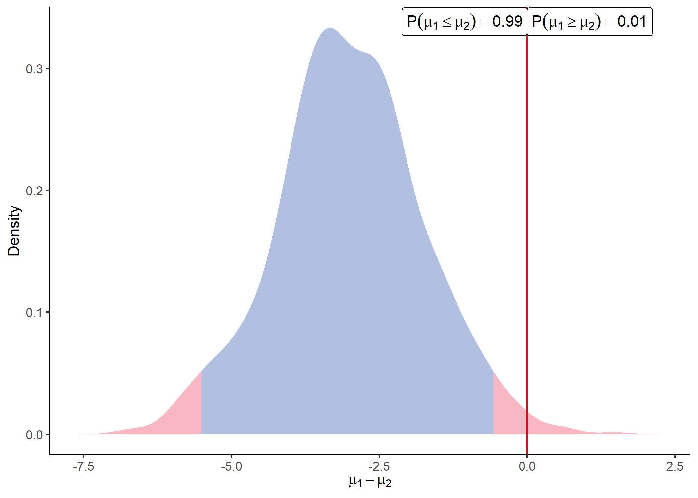

<!-- README.md is generated from README.Rmd. Please edit that file -->

# ProteoBayes

<!-- badges: start -->
<!-- badges: end -->

Bayesian toolbox for quantitative proteomics. In particular, this
package provides functions to generate synthetic datasets, execute
Bayesian differential analysis methods, and display results.

## Installation

You can install the released version of ProteoBayes from CRAN with:

``` r
install.packages("ProteoBayes")
```

You can install the development version of ProteoBayes like so:

``` r
# install.packages("devtools")
devtools::install_github("mariechion/ProteoBayes", force = TRUE)
#> Downloading GitHub repo mariechion/ProteoBayes@HEAD
#> cli     (3.6.0  -> 3.6.1 ) [CRAN]
#> utf8    (1.2.2  -> 1.2.3 ) [CRAN]
#> Rcpp    (1.0.10 -> 1.0.11) [CRAN]
#> mvtnorm (1.1-3  -> 1.2-2 ) [CRAN]
#> Installing 4 packages: cli, utf8, Rcpp, mvtnorm
#> Installing packages into 'C:/Users/user/Documents/R/win-library/4.1'
#> (as 'lib' is unspecified)
#> 
#>   There are binary versions available but the source versions are later:
#>         binary source needs_compilation
#> Rcpp    1.0.10 1.0.11              TRUE
#> mvtnorm  1.1-3  1.2-2              TRUE
#> 
#> package 'cli' successfully unpacked and MD5 sums checked
#> Warning: cannot remove prior installation of package 'cli'
#> Warning in file.copy(savedcopy, lib, recursive = TRUE): problem copying
#> C:\Users\user\Documents\R\win-library\4.1\00LOCK\cli\libs\x64\cli.dll to
#> C:\Users\user\Documents\R\win-library\4.1\cli\libs\x64\cli.dll: Permission
#> denied
#> Warning: restored 'cli'
#> package 'utf8' successfully unpacked and MD5 sums checked
#> Warning: cannot remove prior installation of package 'utf8'
#> Warning in file.copy(savedcopy, lib, recursive = TRUE): problem copying
#> C:\Users\user\Documents\R\win-library\4.1\00LOCK\utf8\libs\x64\utf8.dll to
#> C:\Users\user\Documents\R\win-library\4.1\utf8\libs\x64\utf8.dll: Permission
#> denied
#> Warning: restored 'utf8'
#> 
#> The downloaded binary packages are in
#>  C:\Users\user\AppData\Local\Temp\RtmpEVA6vw\downloaded_packages
#> installing the source packages 'Rcpp', 'mvtnorm'
#> Warning in i.p(...): installation of package 'Rcpp' had non-zero exit status
#> Warning in i.p(...): installation of package 'mvtnorm' had non-zero exit status
#> -- R CMD build -----------------------------------------------------------------
#>          checking for file 'C:\Users\user\AppData\Local\Temp\RtmpEVA6vw\remotes41e845ad4184\mariechion-ProteoBayes-a3c7a40/DESCRIPTION' ...     checking for file 'C:\Users\user\AppData\Local\Temp\RtmpEVA6vw\remotes41e845ad4184\mariechion-ProteoBayes-a3c7a40/DESCRIPTION' ...   v  checking for file 'C:\Users\user\AppData\Local\Temp\RtmpEVA6vw\remotes41e845ad4184\mariechion-ProteoBayes-a3c7a40/DESCRIPTION' (484ms)
#>       -  preparing 'ProteoBayes':
#>    checking DESCRIPTION meta-information ...     checking DESCRIPTION meta-information ...   v  checking DESCRIPTION meta-information
#>       -  checking for LF line-endings in source and make files and shell scripts
#>   -  checking for empty or unneeded directories
#>       -  building 'ProteoBayes_0.0.0.9000.tar.gz'
#>      
#> 
#> Installing package into 'C:/Users/user/Documents/R/win-library/4.1'
#> (as 'lib' is unspecified)
```

## ProteoBayes in a nutshell

Generate a synthetic proteomic dataset with the correct format:

``` r
library(ProteoBayes)
set.seed(42)

## Generate a dataset without imputations
data = simu_db()

## Generate a dataset with multiple imputations
data_imp = simu_db(multi_imp = TRUE)

data
#> # A tibble: 50 x 4
#>    Peptide   Group Sample Output
#>    <chr>     <int>  <int>  <dbl>
#>  1 Peptide_1     1      1   48.8
#>  2 Peptide_1     1      2   46.5
#>  3 Peptide_1     1      3   49.8
#>  4 Peptide_1     1      4   49.9
#>  5 Peptide_1     1      5   47.4
#>  6 Peptide_1     2      1   54.9
#>  7 Peptide_1     2      2   49.4
#>  8 Peptide_1     2      3   52.0
#>  9 Peptide_1     2      4   49.6
#> 10 Peptide_1     2      5   55.0
#> # i 40 more rows
data_imp
#> # A tibble: 250 x 5
#>    Peptide   Group Sample Output  Draw
#>    <chr>     <int>  <int>  <dbl> <int>
#>  1 Peptide_1     1      1   51.8     1
#>  2 Peptide_1     1      1   51.3     2
#>  3 Peptide_1     1      1   51.6     3
#>  4 Peptide_1     1      1   51.9     4
#>  5 Peptide_1     1      1   51.8     5
#>  6 Peptide_1     1      2   52.5     1
#>  7 Peptide_1     1      2   52.6     2
#>  8 Peptide_1     1      2   52.0     3
#>  9 Peptide_1     1      2   52.0     4
#> 10 Peptide_1     1      2   50.8     5
#> # i 240 more rows
```

The parameters of all posterior distributions can be computed thanks to:

``` r

post = posterior_mean(data)

post
#> # A tibble: 10 x 6
#>    Peptide   Group    mu lambda alpha  beta
#>    <chr>     <int> <dbl>  <dbl> <dbl> <dbl>
#>  1 Peptide_1     1  48.8      6   3.5  6.81
#>  2 Peptide_1     2  51.9      6   3.5 17.2 
#>  3 Peptide_2     1  51.5      6   3.5  3.54
#>  4 Peptide_2     2  53.5      6   3.5 10.6 
#>  5 Peptide_3     1  18.6      6   3.5  6.61
#>  6 Peptide_3     2  20.9      6   3.5 11.8 
#>  7 Peptide_4     1  44.0      6   3.5  7.00
#>  8 Peptide_4     2  46.0      6   3.5 17.8 
#>  9 Peptide_5     1  34.0      6   3.5 30.7 
#> 10 Peptide_5     2  37.7      6   3.5  5.40
```

When considering Peptides independently (no inter-Peptides
correlations), the method is unaffected by missing values and no
imputation is necessary.

We can also consider correlations between Peptides by using a
multivariate version of the method. In this context, missing values need
to be imputed beforehand (multiple imputations is accepted), and the
dedicated function is:

``` r
post_imp = multi_posterior_mean(data_imp)
#> Warning: Returning more (or less) than 1 row per `summarise()` group was deprecated in
#> dplyr 1.1.0.
#> i Please use `reframe()` instead.
#> i When switching from `summarise()` to `reframe()`, remember that `reframe()`
#>   always returns an ungrouped data frame and adjust accordingly.
#> i The deprecated feature was likely used in the ProteoBayes package.
#>   Please report the issue to the authors.
#> This warning is displayed once every 8 hours.
#> Call `lifecycle::last_lifecycle_warnings()` to see where this warning was
#> generated.

post
#> # A tibble: 10 x 6
#>    Peptide   Group    mu lambda alpha  beta
#>    <chr>     <int> <dbl>  <dbl> <dbl> <dbl>
#>  1 Peptide_1     1  48.8      6   3.5  6.81
#>  2 Peptide_1     2  51.9      6   3.5 17.2 
#>  3 Peptide_2     1  51.5      6   3.5  3.54
#>  4 Peptide_2     2  53.5      6   3.5 10.6 
#>  5 Peptide_3     1  18.6      6   3.5  6.61
#>  6 Peptide_3     2  20.9      6   3.5 11.8 
#>  7 Peptide_4     1  44.0      6   3.5  7.00
#>  8 Peptide_4     2  46.0      6   3.5 17.8 
#>  9 Peptide_5     1  34.0      6   3.5 30.7 
#> 10 Peptide_5     2  37.7      6   3.5  5.40
```

Once parameters of the posterior distributions are available. We can
sample from those distributions and visualise the differences between
any groups for each peptide by using:

``` r

sample = sample_distrib(post)

plot_distrib(sample, group1 = 1, group2 = 2, peptide = 'Peptide_1' )
```



When comparing a large number of Peptides simultaneously, the function
`identify_diff()` can be used to check for probable differences between
groups for each Peptide:

``` r
identify_diff(post)
#> # A tibble: 10 x 10
#>    Peptide   Group    mu CI_inf CI_sup Group2   mu2 CI_inf2 CI_sup2 Distinct
#>    <chr>     <int> <dbl>  <dbl>  <dbl>  <int> <dbl>   <dbl>   <dbl> <lgl>   
#>  1 Peptide_1     1  48.8   47.7   49.9      2  51.9    50.1    53.6 TRUE    
#>  2 Peptide_1     2  51.9   50.1   53.6      1  48.8    47.7    49.9 TRUE    
#>  3 Peptide_2     1  51.5   50.8   52.3      2  53.5    52.2    54.9 FALSE   
#>  4 Peptide_2     2  53.5   52.2   54.9      1  51.5    50.8    52.3 FALSE   
#>  5 Peptide_3     1  18.6   17.6   19.7      2  20.9    19.5    22.3 FALSE   
#>  6 Peptide_3     2  20.9   19.5   22.3      1  18.6    17.6    19.7 FALSE   
#>  7 Peptide_4     1  44.0   42.9   45.1      2  46.0    44.3    47.7 FALSE   
#>  8 Peptide_4     2  46.0   44.3   47.7      1  44.0    42.9    45.1 FALSE   
#>  9 Peptide_5     1  34.0   31.7   36.3      2  37.7    36.7    38.6 TRUE    
#> 10 Peptide_5     2  37.7   36.7   38.6      1  34.0    31.7    36.3 TRUE
```
